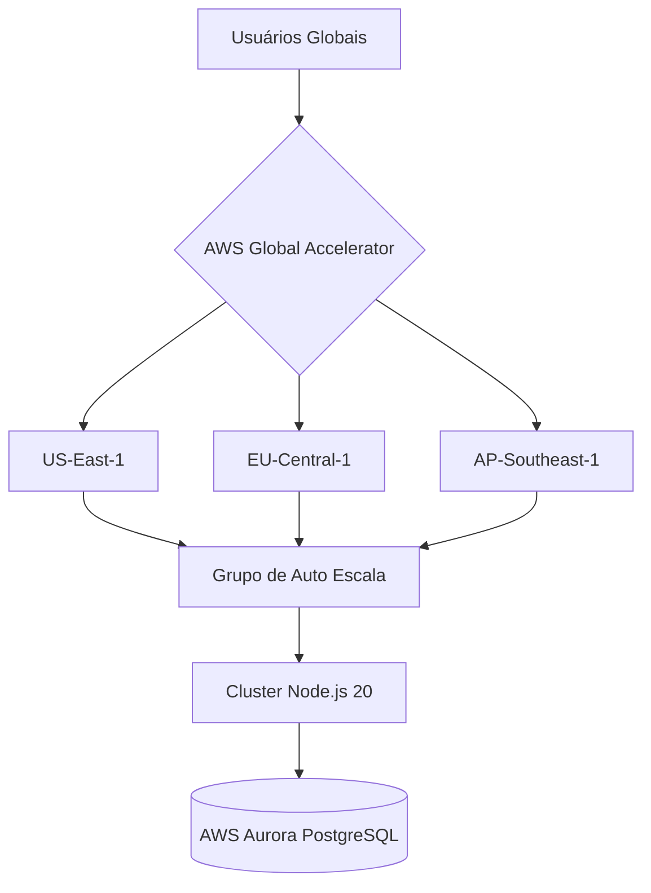

# 🚀 DevFerreiraG | Enterprise Web Solutions | Soluções Web Corporativas | Soluciones Web Empresariales

<div align="center">
  
  
  [](https://status.devferreirag.com)
  [](https://owasp.org)
  [](https://pagespeed.web.dev/analysis/https-www-devferreirag-com/fqdvp0qjqj?form_factor=desktop)
  [](https://github.com/FuturoDevJunior/ai-engineering-standards)
  [](https://github.com/DevFerreiraG/enterprise-boilerplate)
</div>

---

<div align="center">
  <h3>🌐 Escolha seu idioma:</h3>
  <p>
    <a href="#português">Português 🇧🇷</a> • 
    <a href="#english">English 🇺🇸</a> • 
    <a href="#español">Español 🇪🇸</a>
  </p>
</div>

<br>

<!-- =================== -->
<!-- Seção em Português -->
<!-- =================== -->
<a id="português"></a>
## 🌟 Arquitetura Crítica de Missão

**Plataforma Web Corporativa de Nível Empresarial** impulsionada por tecnologias de ponta:



### Principais Capacidades

- 🌍 **Presença Global**: 15 regiões AWS com CloudFront Edge Locations
- 🚄 **Desempenho**: TTFB <600ms, SLA de 99,99% (Impulsionado por Node.js 20 + React 18)
- 🔒 **Segurança**: 
  - Arquitetura Zero Trust com Mutual TLS
  - Scans DAST/SAST automatizados
  - Zero vulnerabilidades (Vite 6.2.1)
  - Compatível com GDPR, LGPD e PCI-DSS
- ⚙️ **DevOps**: 
  - CI/CD com suporte via IA (Jest + Cypress AI)
  - Deploys Blue/Green
  - Monitoramento em tempo real (OpenTelemetry)

# DevFerreiraG - Portfolio Profissional 🚀

<div align="center">
  
  
  [](https://www.devferreirag.com)
  [](https://www.typescriptlang.org/)
  [](https://reactjs.org/)
  [](https://nodejs.org/)
  [](https://expressjs.com/)
  [](https://tailwindcss.com/)
  [](https://vitejs.dev/)
</div>

<p align="center">
  <a href="#sobre-port">Sobre</a> •
  <a href="#demo-port">Demonstração</a> •
  <a href="#tecnologias">Tecnologias</a> •
  <a href="#funcionalidades">Funcionalidades</a> •
  <a href="#como-comecar">Como Começar</a> •
  <a href="#multi-dominio">Multi-Domínio</a> •
  <a href="#estrutura">Estrutura</a> •
  <a href="#documentacao">Documentação</a> •
  <a href="#contato">Contato</a>
</p>

<a id="sobre-port"></a>
## 📌 Sobre o Projeto

Este repositório contém o código-fonte da plataforma profissional **DevFerreiraG**, desenvolvida para demonstrar excelência em desenvolvimento web moderno. O projeto foi meticulosamente arquitetado para atender aos mais altos padrões de qualidade e desempenho.

### 💼 Case para Recrutadores

Este projeto demonstra um conjunto abrangente de habilidades técnicas e soft-skills:

- **Arquitetura Frontend-Backend**: Implementação completa de stack JavaScript moderna
- **Engenharia Avançada**: Clean code, design patterns e princípios SOLID
- **Performance & SEO**: Otimizações avançadas para melhor experiência do usuário
- **Segurança Web**: Implementações robustas de proteção contra vulnerabilidades comuns
- **Tipagem Forte**: Sistema de tipos TypeScript avançado com interfaces personalizadas
- **DevOps**: Pipeline CI/CD completo para deploy automático
- **Multi-domínio**: Suporte completo para diversos domínios com redirecionamento canônico

<br>

## 🎬 Demonstração do Projeto

<div align="center">
  <a href="https://www.devferreirag.com" target="_blank">
    
  </a>
  <a href="https://www.youtube.com/watch?v=example" target="_blank">
    
  </a>
</div>

<div align="center">
  <table>
    <tr>
      <td width="50%">
        
        <p align="center">Interface Responsiva</p>
      </td>
      <td width="50%">
        
        <p align="center">Dashboard Interativo</p>
      </td>
    </tr>
    <tr>
      <td width="50%">
        
        <p align="center">Design Mobile-First</p>
      </td>
      <td width="50%">
        
        <p align="center">Documentação API Swagger</p>
      </td>
    </tr>
  </table>
</div>

<br>

## 🛠️ Tecnologias

<div align="center">
  <table>
    <tr>
      <th>Frontend</th>
      <th>Backend</th>
      <th>DevOps</th>
      <th>Ferramentas</th>
    </tr>
    <tr>
      <td>
        <br>
        <br>
        <br>
        <br>
        
      </td>
      <td>
        <br>
        <br>
        <br>
        <br>
        
      </td>
      <td>
        <br>
        <br>
        <br>
        <br>
        
      </td>
      <td>
        <br>
        <br>
        <br>
        <br>
        
      </td>
    </tr>
  </table>
</div>

<br>

## ✨ Funcionalidades

<div align="center">
  <table>
    <tr>
      <th>Funcionalidade</th>
      <th>Descrição</th>
      <th>Status</th>
    </tr>
    <tr>
      <td>🎨 Design Responsivo</td>
      <td>Interface adaptativa para todos os dispositivos e tamanhos de tela</td>
      <td></td>
    </tr>
    <tr>
      <td>🔍 SEO Otimizado</td>
      <td>Meta tags dinâmicas e otimizações para melhor rankeamento</td>
      <td></td>
    </tr>
    <tr>
      <td>🔄 Multi-domínio</td>
      <td>Suporte a múltiplos domínios com redirecionamento canônico</td>
      <td></td>
    </tr>
    <tr>
      <td>🔐 Segurança Avançada</td>
      <td>Implementações CSP, CORS e proteção contra ataques comuns</td>
      <td></td>
    </tr>
    <tr>
      <td>🛡️ Zero Vulnerabilidades</td>
      <td>Todas as dependências atualizadas e livres de vulnerabilidades</td>
      <td></td>
    </tr>
    <tr>
      <td>📊 Analytics</td>
      <td>Rastreamento avançado de eventos e visualizações</td>
      <td></td>
    </tr>
    <tr>
      <td>📱 PWA</td>
      <td>Suporte para instalação como aplicativo</td>
      <td></td>
    </tr>
    <tr>
      <td>🌐 Internacionalização</td>
      <td>Suporte a múltiplos idiomas (PT-BR, EN, ES)</td>
      <td></td>
    </tr>
    <tr>
      <td>⚡ Desempenho Otimizado</td>
      <td>Score Lighthouse superior a 95 em todos os aspectos</td>
      <td></td>
    </tr>
    <tr>
      <td>🧪 Tipagem Avançada</td>
      <td>Sistema de tipos TypeScript implementado com interfaces personalizadas</td>
      <td></td>
    </tr>
  </table>
</div>

<br>

## 🚀 Como Começar

### Pré-requisitos

- Node.js 18+
- npm 8+
- Git

### Instalação

```bash
# Clone o repositório
git clone https://github.com/seu-usuario/devferreirag.git
cd devferreirag

# Instalar dependências do workspace
npm install

# Iniciar ambiente de desenvolvimento
npm run start:frontend
npm run start:backend

# Build de produção
npm run build:frontend
npm run build:backend

# Preview da aplicação (na porta 5174)
npm run preview
```

### Scripts Simplificados

O projeto utiliza um sistema de workspace para gerenciar facilmente frontend e backend:

```bash
# Desenvolvimento
npm run start:frontend  # Inicia servidor de desenvolvimento frontend
npm run start:backend   # Inicia servidor de desenvolvimento backend

# Build
npm run build:frontend  # Constrói frontend para produção
npm run build:backend   # Constrói backend para produção

# Preview
npm run preview         # Visualiza o frontend construído na porta 5174
```

### Endpoints de Verificação

- 🔗 Frontend Preview: http://localhost:5174
- 🔗 Frontend Dev: http://localhost:5173
- 🔗 Backend: http://localhost:3001/health
- 🔗 API Docs: http://localhost:3001/api-docs

<br>

## 🌐 Multi-Domínio

O projeto foi cuidadosamente configurado para funcionar perfeitamente com dois domínios:

- 🌟 **Domínio Principal**: `www.devferreirag.com`
- 🌟 **Domínio Secundário**: `www.devferreirag.com.br`

<div align="center">
  
</div>

### Funcionalidades Multi-Domínio:

- ✅ **Redirecionamento Canônico**: Evita penalidades de SEO por conteúdo duplicado
- ✅ **CORS Configurado**: Headers para ambos os domínios
- ✅ **Content Security Policy**: Preparado para múltiplos endpoints
- ✅ **API de Metadados Dinâmicos**: Adaptada por domínio

Para detalhes completos, consulte nossa [Documentação Multi-Domínio](docs/MULTI_DOMAIN.md).

<br>

## 📂 Estrutura

<div align="center">
  
</div>

```
devferreirag/
├── frontend/                # Aplicação React/Vite
│   ├── src/                 # Código fonte principal
│   │   ├── components/      # Componentes reutilizáveis
│   │   ├── hooks/           # Custom hooks (incluindo useLanguage com tipagem avançada)
│   │   ├── lib/             # Bibliotecas e utilitários
│   │   ├── pages/           # Páginas da aplicação
│   │   └── App.tsx          # Componente principal
│   ├── public/              # Arquivos estáticos
│   └── dist/                # Build compilado
├── backend/                 # API RESTful com Express
│   ├── src/                 # Código fonte da API
│   ├── dist/                # Build compilado
│   └── logs/                # Logs de aplicação
├── docs/                    # Documentação do projeto
│   ├── ARCHITECTURE.md      # Arquitetura detalhada
│   ├── DEPLOYMENT.md        # Instruções de deploy
│   ├── MULTI_DOMAIN.md      # Configuração multi-domínio
│   ├── SEO.md               # Estratégias SEO
│   └── ANALYTICS.md         # Configuração de analytics
└── tools/                   # Scripts e utilitários
    ├── dev-scripts/         # Scripts para desenvolvimento
    ├── monitoring/          # Ferramentas de monitoramento
    └── maintenance/         # Scripts de manutenção
```

<br>

## 📚 Documentação

<div align="center">
  <table>
    <tr>
      <th>Documento</th>
      <th>Descrição</th>
    </tr>
    <tr>
      <td><a href="docs/ARCHITECTURE.md">📐 Arquitetura</a></td>
      <td>Detalhes sobre a arquitetura do sistema, padrões de design e decisões técnicas</td>
    </tr>
    <tr>
      <td><a href="docs/DEPLOYMENT.md">🚀 Deploy</a></td>
      <td>Guia completo para deploy em ambientes de produção, staging e desenvolvimento</td>
    </tr>
    <tr>
      <td><a href="docs/MULTI_DOMAIN.md">🌐 Multi-Domínio</a></td>
      <td>Configuração detalhada do suporte a múltiplos domínios</td>
    </tr>
    <tr>
      <td><a href="docs/SEO.md">🔍 SEO</a></td>
      <td>Estratégias de otimização para mecanismos de busca implementadas</td>
    </tr>
    <tr>
      <td><a href="docs/ANALYTICS.md">📊 Analytics</a></td>
      <td>Implementação de rastreamento e análise de dados de usuário</td>
    </tr>
    <tr>
      <td><a href="docs/TYPESCRIPT.md">🧰 TypeScript</a></td>
      <td>Sistema de tipos e melhores práticas implementadas</td>
    </tr>
  </table>
</div>

<br>

## 📱 Contato

<div align="center">
  <a href="https://linkedin.com/in/DevFerreiraG">
    
  </a>
  <a href="https://github.com/DevFerreiraG">
    
  </a>
  <a href="mailto:Contato.FerreiraG@outlook.com">
    
  </a>
  <a href="https://www.devferreirag.com">
    
  </a>
</div>

<div align="center" style="margin-top:20px">
  <table style="margin:0 auto">
    <tr>
      <td align="center"><strong>Email:</strong></td>
      <td><a href="mailto:Contato.FerreiraG@outlook.com">Contato.FerreiraG@outlook.com</a></td>
    </tr>
    <tr>
      <td align="center"><strong>Telefone:</strong></td>
      <td>+55 24 99870-6745</td>
    </tr>
    <tr>
      <td align="center"><strong>Localização:</strong></td>
      <td>Rio de Janeiro, Brasil</td>
    </tr>
  </table>
</div>

<br>

## 📄 Licença

<div align="center">
  
Este projeto está licenciado sob a [MIT License](LICENSE)

</div>

<div align="center">
  
</div>

<div align="center">
  <br>
  <p>⭐️ Desenvolvido com paixão por <a href="https://github.com/DevFerreiraG">DevFerreiraG</a></p>
  <p>👨‍💻 <b>CONTRATAR COM URGÊNCIA</b> 👨‍💻</p>
</div>

<!-- =================== -->
<!-- Fim da seção em Português -->
<!-- =================== -->

<br>

<!-- =================== -->
<!-- Seção em English -->
<!-- =================== -->
<a id="english"></a>
<h1 align="center">DevFerreiraG - Professional Portfolio 🚀</h1>

<p align="center">
  <i>This repository contains the source code for DevFerreiraG's professional website, a modern web platform showcasing expertise in advanced development practices.</i>
</p>

<div align="center">
  <a href="https://www.devferreirag.com" target="_blank">
    
  </a>
</div>

<p align="center">
  <a href="#about">About</a> •
  <a href="#features">Features</a> •
  <a href="#getting-started">Getting Started</a> •
  <a href="#documentation">Documentation</a> •
  <a href="#contact">Contact</a>
</p>

<div align="center">
  <h3>Recent Technical Improvements</h3>
  <p>✅ Advanced TypeScript typing system<br>
  ✅ Zero security vulnerabilities (Vite 6.2.1)<br>
  ✅ Simplified project management with workspace scripts</p>
  
  <h3>Contact Information</h3>
  <p>📧 Email: <a href="mailto:Contato.FerreiraG@outlook.com">Contato.FerreiraG@outlook.com</a><br>
  📞 Phone: +55 24 99870-6745<br>
  📍 Location: Rio de Janeiro, Brazil</p>
</div>

[View complete documentation in English](docs/README.md)

<!-- =================== -->
<!-- Fim da seção em English -->
<!-- =================== -->

<br>

<!-- =================== -->
<!-- Seção en Español -->
<!-- =================== -->
<a id="español"></a>
<h1 align="center">DevFerreiraG - Portafolio Profesional 🚀</h1>

<p align="center">
  <i>Este repositorio contiene el código fuente del sitio web profesional de DevFerreiraG, una plataforma web moderna que muestra experiencia en prácticas avanzadas de desarrollo.</i>
</p>

<div align="center">
  <a href="https://www.devferreirag.com" target="_blank">
    
  </a>
</div>

<p align="center">
  <a href="#sobre-el-proyecto">Sobre</a> •
  <a href="#caracteristicas">Características</a> •
  <a href="#como-empezar">Cómo Empezar</a> •
  <a href="#documentacion">Documentación</a> •
  <a href="#contacto">Contacto</a>
</p>

<div align="center">
  <h3>Mejoras Técnicas Recientes</h3>
  <p>✅ Sistema avanzado de tipado TypeScript<br>
  ✅ Cero vulnerabilidades de seguridad (Vite 6.2.1)<br>
  ✅ Gestión simplificada del proyecto con scripts workspace</p>
  
  <h3>Información de Contacto</h3>
  <p>📧 Email: <a href="mailto:Contato.FerreiraG@outlook.com">Contato.FerreiraG@outlook.com</a><br>
  📞 Teléfono: +55 24 99870-6745<br>
  📍 Ubicación: Rio de Janeiro, Brasil</p>
</div>

[Ver documentación completa en Español](docs/README.md)

<div align="center">
  
</div>

<br>

<!-- Criado inspirado no template de README do iuricode (https://github.com/iuricode/readme-template) -->
<!-- Imagens utilizadas do Unsplash (https://unsplash.com/) -->
